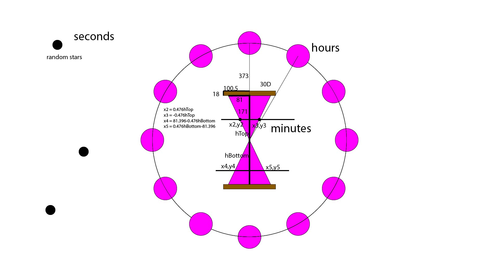

# HW04 A

In this task, I created my imaginary of the god of time, it is made up of eyes that represent hours; a sand clock that represent minutes and stars that represent seconds.

For the star part, what it does is that stars would appear in random position according to the number of seconds and would reset when the second number turns to zero. I used a loop that would add one more star at a random position on the screen according to the seconds.

For the eyes part, what it does is that there will be a series of eyes surrounding the center of the canvas. The number of the eyes is equal to the number of the current hour. I also used a loop to complete this. I move 0,0 to the center of the screen and make the eye shape that has a certain distance from the center to rotate around the center. Because the max number of the eyes is 12, so the degree eyes would turn every time is 360/12=30. So I create a loop to add a new eye that is rotated 30 degrees from the former one until the hour is 12.

For the sand clock part, the "sand" in the top part of it will slowly go into the bottom part according to minutes. The logic I created this is really simple: basicly the height of the sand in the top part should equals to the empty part of the bottom part. So I created an empty color triangle for top and a sand color triangle for the bottom part of the sand clock as their base (that wouldn't move). And then, I created two traingles (same shape but the top one is in sand color and the bottom one is in empty color) that would decrease their height according to time because the sand part for the top and the empty part for the bottom should both decrease as the minutes' number grows.

Those are exactly what I planned for at first and what I am able to compelete. The hardest part for me would be the eyes part... Because it is a little trick that I realize there wil be possibility that some people's computer is 12 hours and some are 24 hours. Plus, at noon time the clock would say 12:00 while at midnight 00:00. So I need to make the number of eyes 12 when the clock is saying 0, and minus by 12 if the number is larger than 12. Plus, the rotation according to hours part of the eyes is also a bit comlpex, it took me several try to get this right.

Image on repo:  

